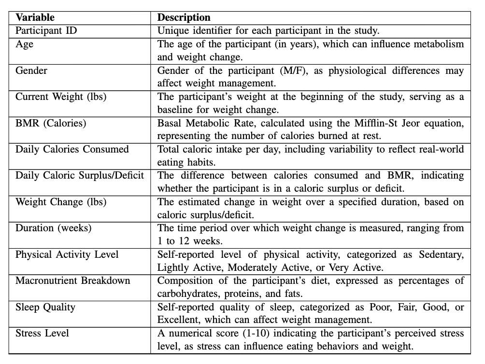
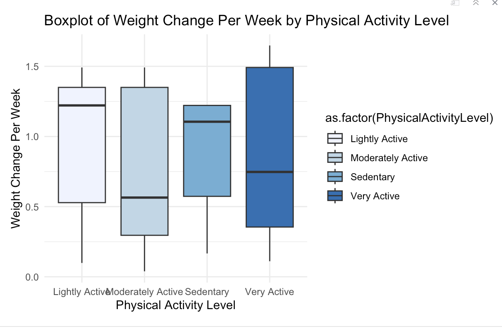
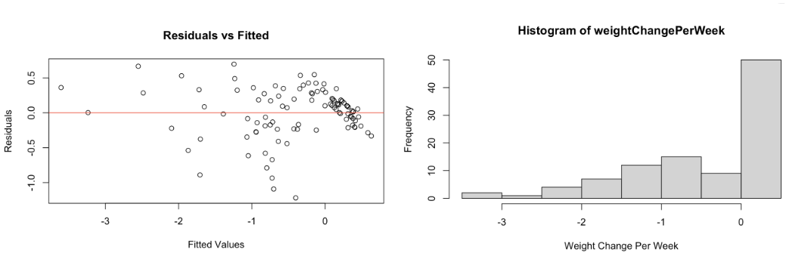
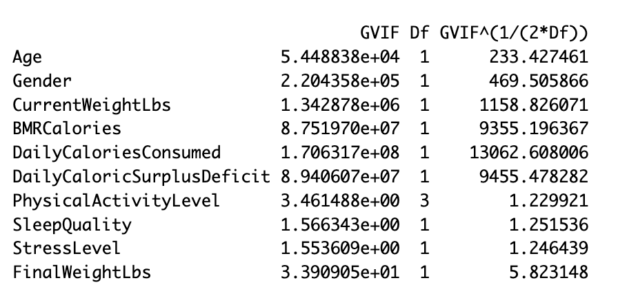
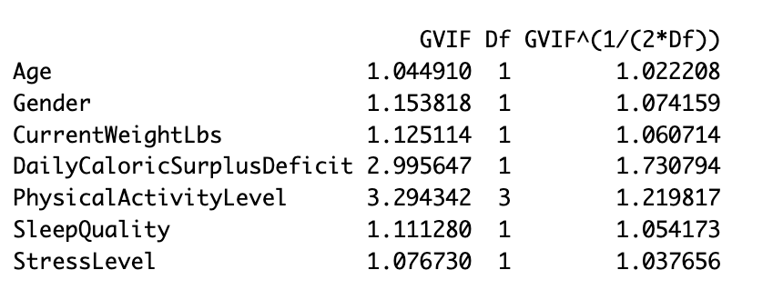
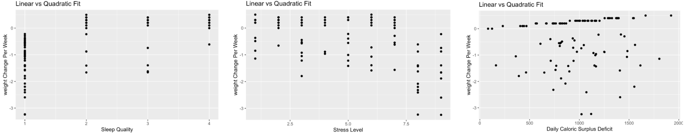
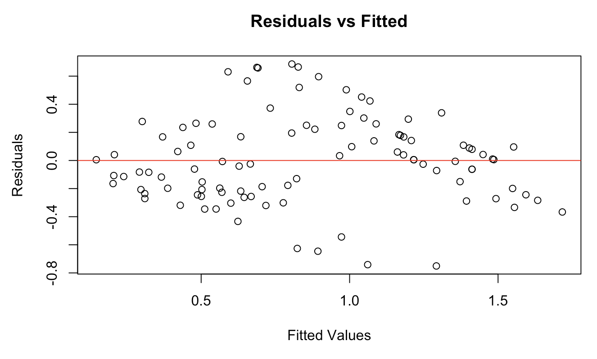

```{r setup, include=FALSE}
knitr::opts_chunk$set(echo = TRUE)
```

group members: Ruodan Deng, Xiaomeng Zhou, Lavender YU, Anne Zhou

## Background

Health is always a topic of concern, with weight serving as an important indicator of overall well-being. Weight is influenced by a multitude of factors, making it challenging to fully understand the precise contributions of each. This project aims to explore possible factors in detail and identify the key determinants of an individual's weight. In this project, we developed a predictive model forecasting weight changes over a specified period based on various influencing variables. By examining these factors, the model seeks to provide insightful information that could help both individuals to better understand weight dynamics and create personalized weight management strategies based on their personal needs.

## Source of Data

The data for this project comes from the Comprehensive Weight Change Prediction dataset on Kaggle, created by Abdullah. It includes data from 100 participants, with a focus on demographics, dietary habits, physical activity, and lifestyle factors, all aimed at predicting weight change over time. Key features of the dataset include age, gender, current weight, daily caloric intake, macronutrient breakdown, sleep quality, and stress levels. The categorical variables are gender and physical activity level, while the continuous variables include age, current weight, BMR, daily calorie surplus/deficit, weight change, and duration. However, the dataset lacks details on how and when the data were collected from the participants.

Data: <https://www.kaggle.com/datasets/abdullah0a/comprehensive-weight-change-prediction>

## Description of Data

{width="304"}

## **Data Cleaning**

The data was cleaned to prepare it for further exploration. The SleepQuality variable, which initially had categorical levels like "Excellent", "Good", "Fair", and "Poor", was transformed into a numeric scale (ranging from 4 to 1) to reflect its ordinal nature. This transformation facilitates more meaningful analysis of how sleep quality influences weight change.

Column names were updated for clarity and consistency, making the data more intuitive to work with. For instance, Sleep.Quality was renamed to SleepQuality, and WeightChangeLbs was retained as WeightChangeLbs (note: it was already appropriately named).

The Gender variable, initially a character string, was converted into a factor with two levels, "M" (Male) and "F" (Female), ensuring proper handling in statistical models.

The variable Participate ID will not be used in this project as it is not so helpful for the regression model.

A new variable, weightChangePerWeek, was created to provide a normalized measure of weight change by dividing the total weight change (WeightChangeLbs) by the duration of the study (DurationWeeks). This metric offers a clearer view of the rate of weight change over time.

The final cleaned dataset now includes a comprehensive set of variables: Age, Gender, BMRCalories, DailyCaloriesConsumed, PhysicalActivityLevel, SleepQuality, StressLevel, and the newly derived weightChangePerWeek. This enriched dataset enables deeper exploration of how various factors---such as caloric intake, sleep quality, and physical activity---interact to influence weight change.

-   **Boxplot:**The boxplot illustrates the distribution of weight change per week (expWeightCPW) across different physical activity levels (Sedentary, Lightly Active, Moderately Active, and Very Active). It reveals that the median difference between levels is not large. The medians for Lightly Active and Sedentary are close together with similar distribution, and the p-value for Sedentary is high at 0.9, so we combined it with the baseline (Lightly Active).

    .{width="305"}

## Transformation

To assess whether a transformation was needed for the model, we initially fit a linear regression model using weightChangePerWeek as the response variable and all other factors as predictors. The residuals from this model were plotted against the fitted values to check for any obvious patterns or trends that might indicate issues with the assumptions of linear regression.

The plot revealed a left-skewed pattern in the residuals, suggesting that normality assumption of the model cannot be assumed. This indicated the need for a transformation



Therefore, we applied a logarithmic transformation to the weightChangePerWeek variable. After refitting the model using the transformed variable, the residual plot showed a more random scatter around zero, suggesting that the transformation had improved the fit and addressed the skewness in the data.

{width="310"}

Finally, the transformed variable was added to the dataset as expWeightCPW, replacing the original weightChangePerWeek. This transformed dataset is now better prepared for further analysis.

## **Multicollinearity**

To check for multicollinearity in the dataset, we first focused on the numeric variables by calculating the correlation matrix. This allowed us to examine how strongly the variables are correlated with each other.

We visualized the correlation matrix using a heatmap, where stronger correlations were highlighted in red, and weaker correlations were shown in blue. This helped identify any highly correlated pairs of variables that might cause multicollinearity in regression models. The correlation heatmap revealed strong correlations among predictors like `BMRCalories` and `DailyCaloriesConsumed`

{width="317"}

### **VIF Interpretation:**

Next, we assessed multicollinearity by calculating the Variance Inflation Factor (VIF) for the regression model. High VIF values indicate that a predictor variable is highly correlated with other predictors, which can lead to unreliable estimates in the model.

-   **VIF \< 5**: Low multicollinearity, no further action required.

-   **VIF 5--10**: Moderate multicollinearity (consider investigating further).

-   **VIF \> 10**: High multicollinearity (may require remedial measures, such as removing variables or PCA).

    {width="307"}

To reduce multicollinearity, we sequentially removed variables with high VIF values from the model. After each removal, we recalculated the VIF to check for improvement. Specifically, we removed the following variables:BMRCalories, DailyCaloriesConsumed, and FinalWeightLbs.

{width="321"}

With low multicollinearity remaining in the dataset, we can now proceed with more reliable modeling.

**Linear Assumption**

1.  **Linearity**: The relationship between the independent variables chosen and weight change is linear
2.  **Independence**: The dataset comprises data from 100 participants, and it is assumed that each participant's data represents an independent observation.
3.  **Homoscedasticity**: The residual plot indicates a random scatter of points around zero, suggesting that the assumption of homoscedasticity is satisfied.
4.  **Normality of Residuals**: The residuals are normally distributed.

### **Statistical Methodology**

We applied multiple linear regression to investigate how variables like age, stress level, and sleep quality affect weight change per week. To ensure valid inferences:

1.  **Transformation**: A logarithmic transformation was applied to the response variable (`weightChangePerWeek`) to address the skewness and improve model fit.

2.  **Multicollinearity Check**: Variance Inflation Factor (VIF) analysis led to the removal of highly collinear variables such as `BMRCalories` and `DailyCaloriesConsumed`.

3.  **Multicollinearity Analysis**

    We examined multicollinearity by calculating the Variance Inflation Factor (VIF). Initial VIF analysis identified multicollinearity issues, prompting the removal of highly collinear variables such as `BMRCalories`, `DailyCaloriesConsumed`, and `FinalWeightLbs`. After these adjustments, all remaining predictors exhibited VIF values below 5, indicating that multicollinearity had been successfully reduced.

    ## **Model Analysis:**

    We fit five linear regression models to predict **`expWeightCPW`** (expected weight change in pounds) using a set of explanatory variables. For each model, the p-values of the explanatory variables indicate their statistical significance in predicting the outcome.

    ### **Model Selection Using Stepwise Elimination**

    We started with a full model that included all potential predictors. Using a test-based approach, predictors were iteratively removed based on their p-values. Each elimination step was checked to ensure that the adjusted R-squared value did not significantly increase or decrease, indicating that the model retained its explanatory power. The final summary of the model is provided below:

    {width="307"}

    Here are the estimate values from the final model: **Intercept**: 0.3580707; **DailyCaloricSurplusDeficit**: 0.0002750; **SleepQuality**: 0.2869132; **StressLevel**: -0.0803017

    **Model 1**:

    -   **Significant**: DailyCaloricSurplusDeficit (p = 0.0117), SleepQuality (p = 2.16e-15), StressLevel (p = 1.42e-08).

    -   **Insignificant**: Age, GenderF, CurrentWeightLbs, PhysicalActivityLevel.

    **Model 2** (Excludes PhysicalActivityLevel):

    -   **Significant**: DailyCaloricSurplusDeficit (p = 0.00113), SleepQuality (p = 4.64e-16), StressLevel (p = 7.19e-09).

    -   **Insignificant**: Age, GenderF, CurrentWeightLbs.

    **Model 3** (Excludes CurrentWeightLbs & PhysicalActivityLevel):

    -   **Significant**: DailyCaloricSurplusDeficit (p = 0.00125), SleepQuality (p = 3.69e-16), StressLevel (p = 5.66e-09).

    -   **Insignificant**: Age, GenderF.

    **Model 4** (Excludes Age & CurrentWeightLbs):

    -   **Significant**: DailyCaloricSurplusDeficit (p = 0.00139), SleepQuality (p = 2.58e-16), StressLevel (p = 4.45e-09).

    -   **Insignificant**: GenderF.

    **Model 5** (Excludes Age, Gender, CurrentWeightLbs, PhysicalActivityLevel):

    -   **Significant**: DailyCaloricSurplusDeficit (p = 0.00185), SleepQuality (p = 2.78e-16), StressLevel (p = 5.27e-09).

        During the model selection process, we tested the significance of the predictors through backwards selection, The focus was on removing variables that were not statistically significant. This process involved analyzing the **p-values** of each predictor in the regression analysis.

    1.  **Significant Predictors**:\
        Predictors such as `DailyCaloricSurplusDeficit`, `SleepQuality`, and `StressLevel` had extremely low p-values (p \< 0.01), indicating their strong association with the response variable, `weightChangePerWeek`. Given their high level of significance, we retained these predictors in the final model.

    2.  **Excluded Predictors**:\
        Variables like `BMRCalories` and `DailyCaloriesConsumed` were excluded due to their high p-values (p \> 0.05) and multicollinearity issues, as indicated by Variance Inflation Factor (VIF) analysis. These variables did not provide additional explanatory power and were removed to improve model reliability.

    By retaining only the statistically significant predictors, the final model captured the most critical factors influencing weight change while ensuring interpretability and reducing overfitting. The substantial reduction in p-values during this refinement process underscores the importance of these variables in explaining variance in weight change.

**Regression Diagnostics**: Residual plots after transformation indicated that the model assumptions were satisfied, with no discernible patterns in the residuals.

{width="303"}

-   **Model Refinement**\
    As part of our refinement process, we explored the inclusion of interaction effects and quadratic relationships:

    1.  **Interaction Effects**:

        -   Scatterplots of covariates across **StressLevel**, **SleepQuality**, and **DailyCaloricSurplusDeficit** revealed variations in slopes and intercepts.

        -   We tested interaction terms, such as **DailyCaloricSurplusDeficit × StressLevel**, for statistical significance.

        -   None of these terms were significant (p\>0.05p \> 0.05p\>0.05), leading to their exclusion to avoid unnecessary model complexity.

        

        **Quadratic Relationships**:\
        To assess whether quadratic terms might enhance the model, we plotted scatterplots of covariates against the response variable (`weightChangePerWeek`). These plots showed no evident curvature, suggesting that relationships between covariates and weight change per week were linear. Therefore, quadratic terms were excluded from the model to maintain simplicity and interpretability.

    Here are the three plot of the **Quadratic:**

    

-   **QQ Plot**: The QQ plot confirmed the residuals followed a normal distribution, supporting the validity of the model.

    ### {width="298"}

### **Mallow's Cp (**1.81619177250955**), Adjusted R-squared (0.6), and QQ Plot**

Mallow's Cp analysis showed that the final model balanced complexity and predictive accuracy. The Cp value remained close to the number of predictors in the final model, indicating no excessive overfitting. Adjusted R-Squared confirmed that the model explained a substantial portion of the variance while maintaining parsimony, with no significant improvement when non-significant predictors were removed. Residual Plot analysis displayed no discernible patterns, demonstrating that the assumptions of linearity and homoscedasticity were met. QQ Plot indicated that the residuals closely followed the normal distribution, supporting the validity of the linear regression model.

## **Conclusion**

Our final model, evaluated using Leave-One-Out Cross-Validation (LOOCV), yielded a Mean Squared Error (MSE) of **0.3396**. This corresponds to an approximate predictive accuracy of **66%**, suggesting room for improvement in the model's performance. While the adjusted R-squared value and Mallow's Cp analysis supported the model's validity, this accuracy level indicates that certain limitations may have influenced the results:

1.  **Sample Size**: The dataset comprised only 100 participants, which might not sufficiently capture the variability in weight change across diverse populations.

2.  **Predictor Selection**: Despite our efforts to select significant predictors, it is possible that important variables influencing weight change---such as metabolic rate, hormonal factors, or detailed dietary patterns---were omitted due to the limitations of the dataset.

3.  **Model Complexity**: The relatively high error and moderate predictive accuracy could also reflect the challenges of capturing complex, nonlinear relationships between weight change and influencing factors within a simple linear model.

    {width="285"}

### **Future Directions**

To improve the model's accuracy and robustness in future studies, we recommend the following:

-   **Incorporating Additional Predictors**: Including variables such as metabolic rate fluctuations, detailed dietary patterns, and stress management techniques could better capture the factors driving weight change.

-   **Expanding the Dataset**: Collecting data from a larger and more diverse population would enhance the generalizability of the model and reduce overfitting risks.

-   **Exploring Advanced Models**: Nonlinear or machine learning models, such as Random Forests or Gradient Boosting, might better capture complex interactions between predictors.

Although this model did not perform as well as expected, it highlights key behavioral factors influencing weight change, providing valuable insights for personalizing weight management strategies. Future iterations of this analysis, incorporating a broader dataset and additional predictors, hold promise for achieving more accurate and actionable results.
