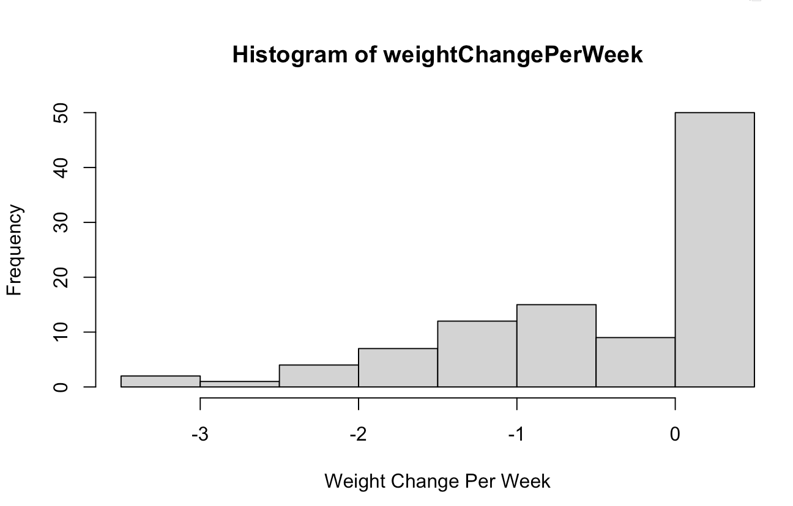
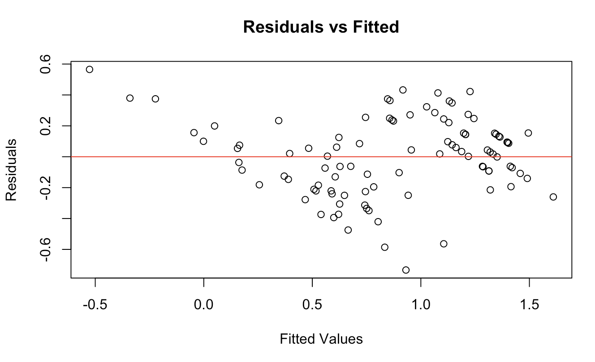
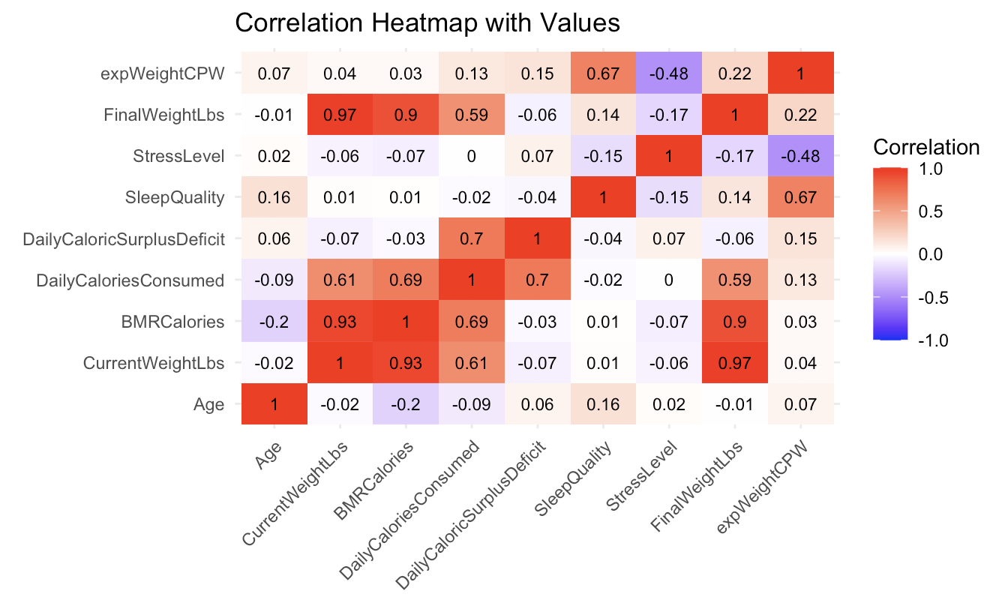
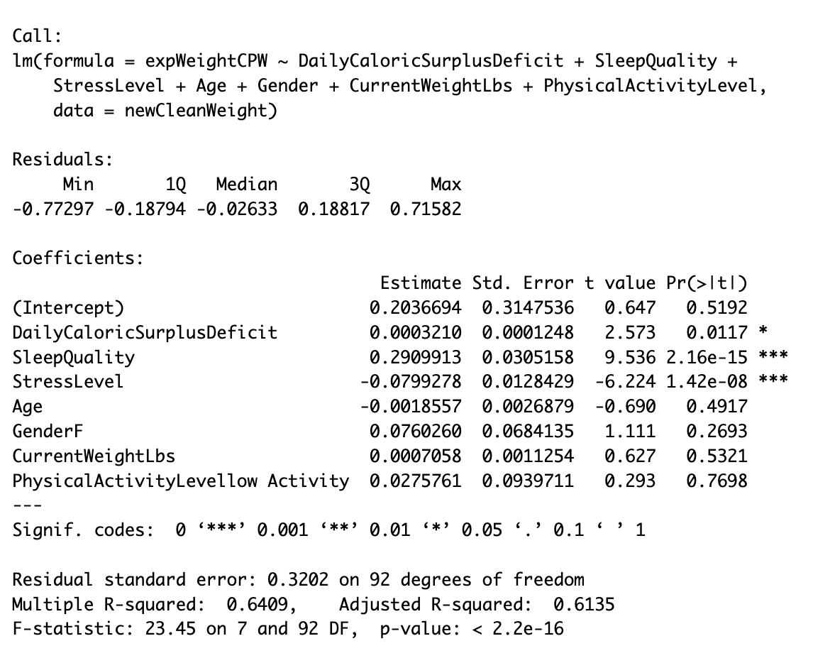
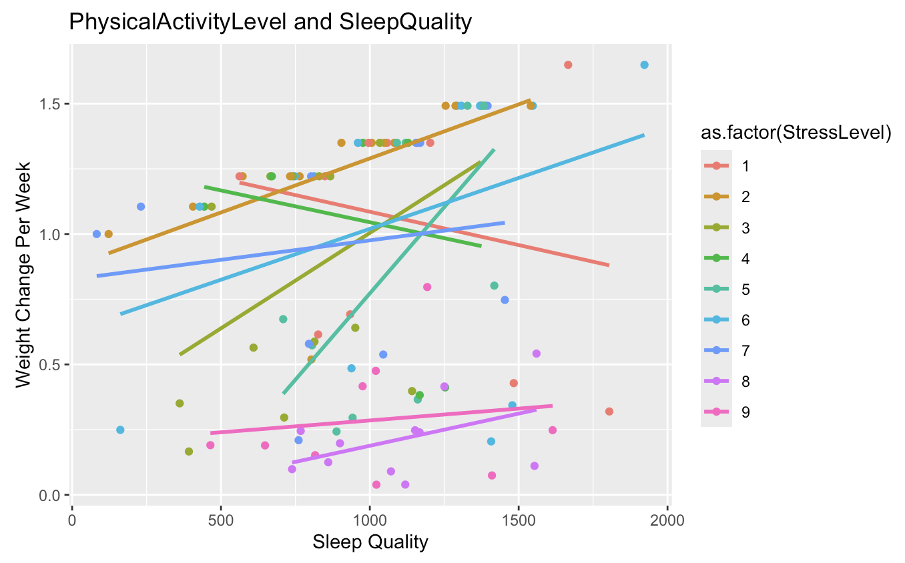

```{r setup, include=FALSE}
knitr::opts_chunk$set(echo = TRUE)
```

## Background

Health is always a topic of concern, with weight serving as an important indicator of overall well-being. Weight is influenced by a multitude of factors, making it challenging to fully understand the precise contributions of each. This project aims to explore possible factors in detail and identify the key determinants of an individual's weight. In this project, we developed a predictive model forecasting weight changes over a specified period based on various influencing variables. By examining these factors, the model seeks to provide insightful information that could help both individuals to better understand weight dynamics and create personalized weight management strategies based on their personal needs.

## Source of Data

The data for this project comes from the Comprehensive Weight Change Prediction dataset on Kaggle, created by Abdullah. It includes data from 100 participants, with a focus on demographics, dietary habits, physical activity, and lifestyle factors, all aimed at predicting weight change over time. Key features of the dataset include age, gender, current weight, daily caloric intake, macronutrient breakdown, sleep quality, and stress levels. The categorical variables are gender and physical activity level, while the continuous variables include age, current weight, BMR, daily calorie surplus/deficit, weight change, and duration. However, the dataset lacks details on how and when the data were collected from the participants.

Data: <https://www.kaggle.com/datasets/abdullah0a/comprehensive-weight-change-prediction>

## Description of Data


## **Data Cleaning**

The data was cleaned to prepare it for further exploration. The SleepQuality variable, which initially had categorical levels like "Excellent", "Good", "Fair", and "Poor", was transformed into a numeric scale (ranging from 4 to 1) to reflect its ordinal nature. This transformation facilitates more meaningful analysis of how sleep quality influences weight change.

Column names were updated for clarity and consistency, making the data more intuitive to work with. For instance, Sleep.Quality was renamed to SleepQuality, and WeightChangeLbs was retained as WeightChangeLbs (note: it was already appropriately named).

The Gender variable, initially a character string, was converted into a factor with two levels, "M" (Male) and "F" (Female), ensuring proper handling in statistical models.

The variable Participate ID will not be used in this project as it is not so helpful for the regression model.

A new variable, weightChangePerWeek, was created to provide a normalized measure of weight change by dividing the total weight change (WeightChangeLbs) by the duration of the study (DurationWeeks). This metric offers a clearer view of the rate of weight change over time.

The final cleaned dataset now includes a comprehensive set of variables: Age, Gender, BMRCalories, DailyCaloriesConsumed, PhysicalActivityLevel, SleepQuality, StressLevel, and the newly derived weightChangePerWeek. This enriched dataset enables deeper exploration of how various factors—such as caloric intake, sleep quality, and physical activity—interact to influence weight change.

## Transformation

To assess whether a transformation was needed for the model, we initially fit a linear regression model using weightChangePerWeek as the response variable and all other factors as predictors. The residuals from this model were plotted against the fitted values to check for any obvious patterns or trends that might indicate issues with the assumptions of linear regression.

The plot revealed a left-skewed pattern in the residuals, suggesting that normality assumption of the model cannot be assumed. This indicated the need for a transformation.


Therefore, we applied a logarithmic transformation to the weightChangePerWeek variable. After refitting the model using the transformed variable, the residual plot showed a more random scatter around zero, suggesting that the transformation had improved the fit and addressed the skewness in the data.

Finally, the transformed variable was added to the dataset as expWeightCPW, replacing the original weightChangePerWeek. This transformed dataset is now better prepared for further analysis.


## **Multicollinearity**

To check for multicollinearity in the dataset, we first focused on the numeric variables by calculating the correlation matrix. This allowed us to examine how strongly the variables are correlated with each other.

We visualized the correlation matrix using a heatmap, where stronger correlations were highlighted in red, and weaker correlations were shown in blue. This helped identify any highly correlated pairs of variables that might cause multicollinearity in regression models.


Next, we assessed multicollinearity by calculating the Variance Inflation Factor (VIF) for the regression model. High VIF values indicate that a predictor variable is highly correlated with other predictors, which can lead to unreliable estimates in the model.

### **VIF Interpretation:**

-   **VIF \< 5**: Low multicollinearity, no further action required.

-   **VIF 5–10**: Moderate multicollinearity (consider investigating further).

-   **VIF \> 10**: High multicollinearity (may require remedial measures, such as removing variables or PCA).

    

To reduce multicollinearity, we sequentially removed variables with high VIF values from the model. After each removal, we recalculated the VIF to check for improvement. Specifically, we removed the following variables:BMRCalories, DailyCaloriesConsumed, and FinalWeightLbs.


With low multicollinearity remaining in the dataset, we can now proceed with more reliable modeling.


### **Visualizations and Key Features**

-   **Histogram of Weight Change Per Week**

    The initial histogram of `weightChangePerWeek` displayed a left-skewed distribution, emphasizing the need for transformation. This skewness indicated potential violations of the normality assumption critical for linear regression models.

    > 

-   **Residuals vs. Fitted Values Plot(Before and After Transformation)**

    Before transformation, the residuals vs. fitted values plot showed a distinct pattern, suggesting heteroscedasticity. Post-logarithmic transformation (`expWeightCPW`), the residuals appeared randomly scattered around zero, indicating improved adherence to the assumptions of linearity and homoscedasticity.

    Before transformation:

    

    After transformation:

    

-   **Correlation Heatmapand Multicollinearity Check**

    The correlation heatmap revealed strong correlations among predictors like `BMRCalories` and `DailyCaloriesConsumed`. VIF analysis confirmed high multicollinearity, necessitating the removal of these variables to enhance model reliability.

    

-   **Model Selection Using Stepwise Elimination**

    We started with a full model that included all potential predictors. Using a test-based approach, predictors were iteratively removed based on their p-values. Each elimination step was checked to ensure that the adjusted R-squared value did not significantly increase or decrease, indicating that the model retained its explanatory power.
The summary of the full model is provided below, demonstrating the initial complexity before refinement:

    

-   **Interaction and Quadratic Terms**

    We examined potential interaction effects between key variables like DailyCaloricSurplusDeficit and StressLevel and explored quadratic relationships. As shown in the diagnostic plots generated by Mengmeng, the slopes remained consistent across different levels of the interacting variables, and no evidence of curvature was observed. This confirmed that adding interaction or quadratic terms would not significantly enhance model performance. Therefore, the simpler linear model was retained.

    

-   **Mallow's Cp, Adjusted R-squared, and QQ Plot**

    Mallow’s Cp analysis showed that the final model balanced complexity and predictive accuracy. The Cp value remained close to the number of predictors in the final model, indicating no excessive overfitting.
Adjusted R-Squared confirmed that the model explained a substantial portion of the variance while maintaining parsimony, with no significant improvement when non-significant predictors were removed.
Residual Plot analysis displayed no discernible patterns, demonstrating that the assumptions of linearity and homoscedasticity were met.
QQ Plot indicated that the residuals closely followed the normal distribution, supporting the validity of the linear regression model.

### **Statistical Methodology**

We applied multiple linear regression to investigate how variables like age, stress level, and sleep quality affect weight change per week. To ensure valid inferences:

1.  **Transformation**: A logarithmic transformation was applied to the response variable (`weightChangePerWeek`) to address the skewness and improve model fit.

2.  **Multicollinearity Check**: Variance Inflation Factor (VIF) analysis led to the removal of highly collinear variables such as `BMRCalories` and `DailyCaloriesConsumed`.

3.  **Multicollinearity Analysis**

    We examined multicollinearity by calculating the Variance Inflation Factor (VIF). Initial VIF analysis identified multicollinearity issues, prompting the removal of highly collinear variables such as `BMRCalories`, `DailyCaloriesConsumed`, and `FinalWeightLbs`. After these adjustments, all remaining predictors exhibited VIF values below 5, indicating that multicollinearity had been successfully reduced.

4.  **Model Selection and Justification** We used a test-based approach to eliminate insignificant predictors from the full model based on p-values. After each iteration, we checked if the adjusted R-squared value significantly improved. The final model retained the variables `DailyCaloricSurplusDeficit`, `SleepQuality`, `StressLevel`, `Age`, and `Gender`, ensuring all predictors contributed meaningfully to the model.

    Despite considering the inclusion of interaction and quadratic terms, diagnostic plots generated by Mengmeng indicated no significant changes in slope or curvature, making their inclusion unnecessary. Therefore, the simpler linear model was retained.

5.  **Regression Diagnostics**: Residual plots after transformation indicated that the model assumptions were satisfied, with no discernible patterns in the residuals.


#### **Statistical Analysis**

-   **Mallow's Cp**: This measure confirmed that the final model was appropriately balanced between complexity and fit.

-   **Adjusted R-Squared**: The adjusted R-squared value suggested that the model explains a substantial proportion of the variance without overfitting.

-   **Residual Plot**: Residuals were randomly scattered, indicating no violations of linear regression assumptions.

-   **QQ Plot**: The QQ plot confirmed the residuals followed a normal distribution, supporting the validity of the model.

------------------------------------------------------------------------

## **Conclusion**

The analysis identified key determinants of weight change, including caloric surplus, stress level, and sleep quality. Higher caloric surplus was significantly associated with weight gain, while better sleep quality correlated with more controlled weight changes. Stress level had a moderate impact, indicating the need for further research. Our findings demonstrated that behavioral factors significantly influence weight change. However, limitations such as the small sample size (n = 100) and lack of temporal data collection must be noted. Future studies should consider larger, more diverse datasets and include additional factors like metabolic rate changes.

